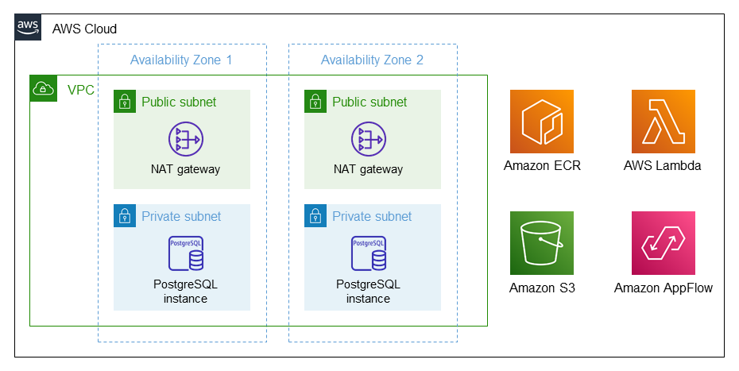
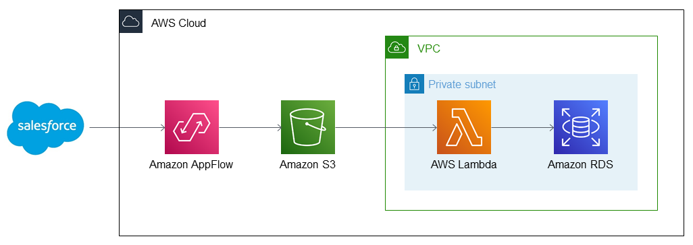

:xrefstyle: short

Deploying this Quick Start for a new virtual private cloud (VPC) with
default parameters builds the following {partner-product-short-name} environment in the
AWS Cloud.

[#architecture1]
.Quick Start architecture for {partner-product-short-name} on AWS

As shown in <<architecture1>>, the Quick Start sets up the following:

* A highly available architecture that spans multiple Availability Zones.*
* A VPC configured with public and private subnets, according to AWS
best practices, to provide you with your own virtual network on AWS.*
* In the public subnets, a managed network address translation (NAT) gateway to allow outbound
internet access for resources in the private subnets.*
* In the private subnets, an Amazon RDS PostgreSQL database.
* Amazon Elastic Container Registry (Amazon ECR) to store Docker images.
* Amazon Simple Storage Service (Amazon S3) to store Salesforce object data.
* An Amazon AppFlow flow, created by an AWS Lambda function, to transfer Salesforce data to Amazon RDS and Amazon S3.

[.small]#* The template that deploys the Quick Start into an existing VPC skips the components marked by asterisks and prompts you for your existing VPC configuration.#

[#architecture2]
.Quick Start flow diagram for {partner-product-short-name} on AWS

As shown in <<architecture2>>, this Quick Start sets up the following workflow:

* Salesforce object data is transferred to Amazon AppFlow.
* Amazon AppFlow relays Salesforce data to Amazon S3.
* Amazon S3 relays object data to AWS Lambda, which sits inside a private subnet of your VPC.
* AWS Lambda transfers your Salesforce data to Amazon RDS.