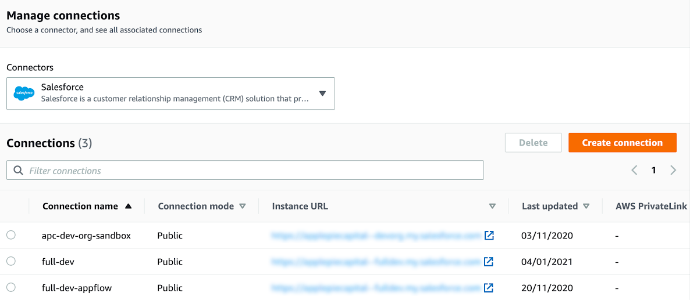
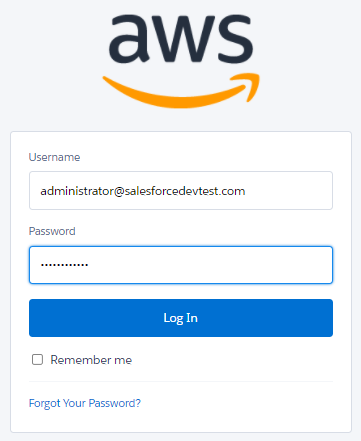

// If no preperation is required, remove all content from here
=== Prepare for the deployment

=== Prerequisites

* To access Salesforce from Amazon AppFlow, your Salesforce edition must have API access. Salesforce editions, such as enterprise, unlimited, developer, and performance provide API access, but professional and essentials editions do not. Before proceeding, check the latest information about which editions provide API access.
* Naming conventions are strict for objects, so use exact object names. For more information, see https://developer.salesforce.com/docs/atlas.en-us.object_reference.meta/object_reference/sforce_api_objects_list.htm[Object Reference for Salesforce and Lightning Platform^]. Note that object support may vary across Salesforce editions.

==== Create an Amazon AppFlow connection in Salesforce

. Create a new connection in Amazon AppFlow.
.. Ensure that you are in the same Region in which you deploy this Quick Start.
.. Navigate to *Connections* in Amazon AppFlow.
.. Choose *Salesforce* and then *Create connection*.
+
[#prereq1]
.Amazon AppFlow connections

+
. Choose *Sandbox* or *Production*, based on the Salesforce instance type, and add a new connection name. Choose *Continue*.
+
[#prereq2]
.Create a new connection

+
. Add Salesforce credentials for the user account, and then choose *Log In*.
+
[#prereq3]
.Entering Salesforce credentials

+
. Choose *Allow* to allow access.
+
[#prereq4]
.Allowing Amazon AppFlow access to Salesforce

+
. Verify that the new connection name is listed in the connections list. Note that the connection name is required for deploying this Quick Start.
+
[#prereq4]
.Amazon AppFlow connections

